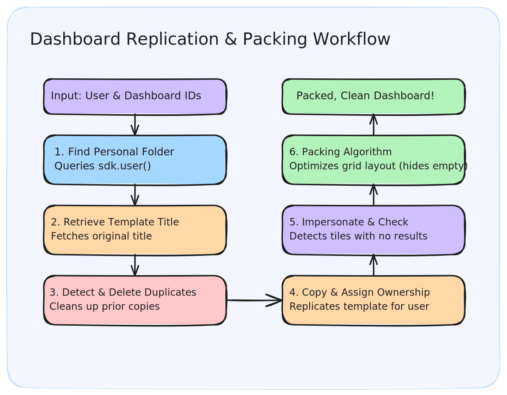

# db-no-results-layout-filter Guide

This document describes the design, installation, and execution workflow of the [main.py](main.py) script, designed to be executed directly via `uv run`.

---

## Operational Workflow

The script processes user and dashboard replication request in six sequential steps:



### 1. Find User Personal Space

Queries `sdk.user()` to retrieve `personal_folder_id` (falling back to `home_folder_id`).

### 2. Retrieve Template Title

Looks up the original dashboard template to fetch its `title`.

### 3. Duplicate Detection & Deletion

Queries the personal folder for any existing dashboard with the exact same title. If any are found, it deletes them.

### 4. Copy and Reassign Ownership

Duplicates the template into the target space and assigns ownership to the target user.

### 5. Check for No Results (Empty Tiles)

Impersonates the user, executes each query on the dashboard, and tracks which elements returned `0` rows.

### 6. 24-Column Greedy Layout Packing Algorithm

The script maps each layout using `build_template_component_map`, partitions components via `partition_active_and_inactive_tiles`, sets empty tiles to hidden (`deleted=True`), and passes active tiles to `run_packing_algorithm(active_pairs)` which:

- Sorts active tiles by their original template `row` and `column`.
- Evaluates vertical constraints: a tile is never placed above another tile that had a strictly lower original row coordinate.
- Fits each tile into the first available non-overlapping slot within the 24-column boundary.
- Returns the final calculated row, column, width, and height coordinates.

---

## How to Run the Script

### Prerequisites

Create a `.env` file from the example template:

```bash
cp .env.example .env
```

Then populate the `.env` file with your Looker SDK environment variables:

```env
LOOKERSDK_BASE_URL="https://your-looker-instance.com:19999"
LOOKERSDK_CLIENT_ID="your_client_id"
LOOKERSDK_CLIENT_SECRET="your_client_secret"
```

### Run Command

Execute the script with `uv run` while loading the `.env` file:

```bash
uv run --env-file .env main.py <looker-user-id> <dashboard-template-id>
```

---

## Iterating Over Multiple Users

If you want to run this script for multiple users, you can write a simple wrapper script that utilizes `sdk.search_users()` to find target users and iterate over them:

```python
import subprocess
import looker_sdk

# Initialize Looker SDK
sdk = looker_sdk.init40()

# Define the template dashboard to replicate
template_id = "12345"

# Search for all active (non-disabled) users
active_users = sdk.search_users(is_disabled=False, fields="id,email")

for user in active_users:
    if not user.id:
        continue
        
    print(f"Processing dashboard for user: {user.email} (ID: {user.id})")
    
    # Execute main.py as a subprocess for each user
    subprocess.run([
        "uv", "run", "--env-file", ".env", "main.py",
        str(user.id),
        template_id
    ], check=True)
```
