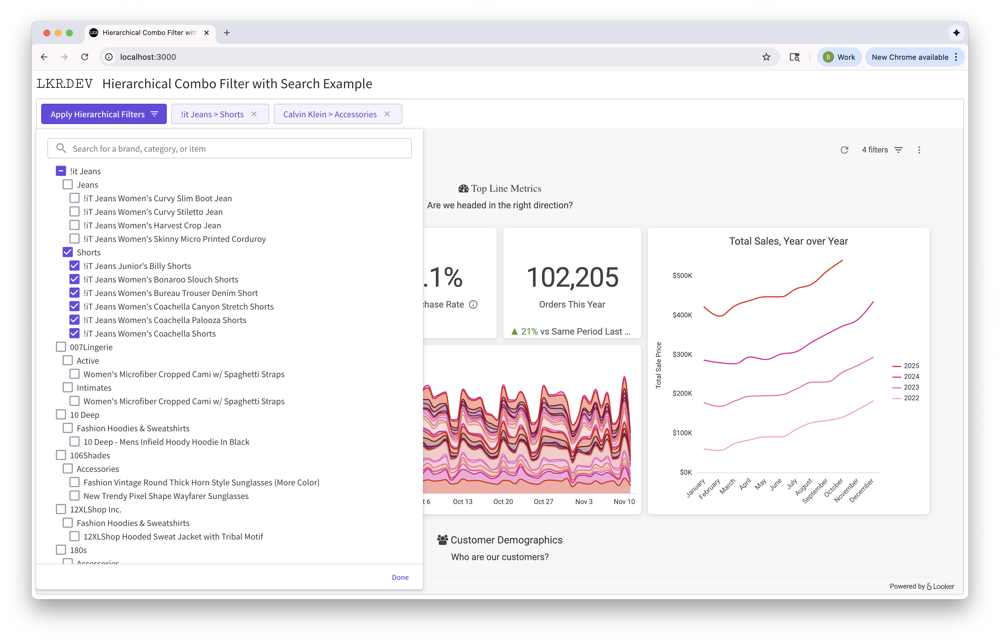

# Hierarchical Combo Filter with Search Example

This is an example of embedding Looker and creating a custom hierarchical filter component that interacts with the Looker iframe. The example showcases how to pull data from the Looker API using the Node SDK, modifying the API request to provide advanced searching functionalty and applying a custom component to the embedded Looker dashboard.

## Embed SDK

### Updating Iframe with Javascript events (dashboard:filters:update)

### Mapping the hierarchy selection to proper dashboard filters

## Looker API SDK (Node)

### Custom Filters

-   createFilterExpression and `matches_filter()`

### Mapping the results to a hierarchy data type

## Performance

### Aggregate Tables
