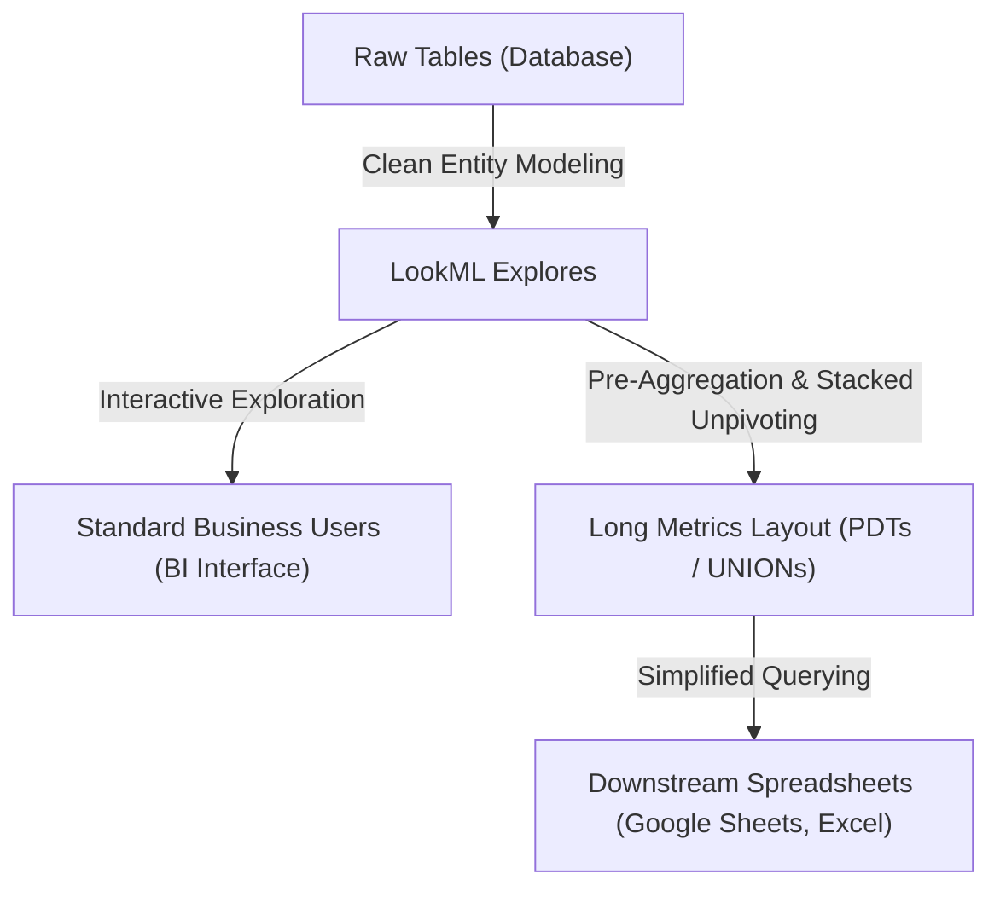

# Long Metrics Table

This example shows how to model LookML views to generate a **long metrics table** (narrow format). The philosophy behind this pattern is to maintain proper, robust data modeling in LookML for standard exploration, while layering simplified slices on top for specific use cases like financial reporting.

First, standard LookML modeling keeps core data (such as order items, products, users) structured with standard relationships and measures. This ensures that business analysts and standard users can still explore the data interactively with full granularity in Looker.

Second, for specific external consumption use cases, such as Finance teams pulling data into Google Sheets, Excel, or Coefficient, we construct a simplified, pre-aggregated long metrics table view on top of our clean core models.

By structuring the output as a long metrics table, we unpivot the metrics and timeframes into simple dimensions:

- Timeframe/Window, Period Alignment, and Metric Names are converted into simple dimensions.
- A single, generic `value` column is exposed.
- In Looker, these values are then **re-measured** (aggregated using measures like `type: sum` with filters applied to the `metric` dimension) to expose them as clean, governed metrics.

This makes it easy for spreadsheet users to consume the data. They can build clean pivot tables or filter using standard dropdowns (filtering by Metric or Timeframe) and plot the single Value field, without needing custom formulas, complex Looker dimensions, or query rewrites.

This layout is also highly beneficial within Looker itself. Instead of building complex LookML fields or maintaining multiple dashboard tiles, you can use Looker's native [Table visualization](https://cloud.google.com/looker/docs/table-next-visualizations) or the advanced [lkr.dev Report Table visualization](https://lkr.dev/docs/visualizations/viz-report-table-marketplace2) to construct flexible, dynamic reports by pivoting directly on the metric and timeframe dimensions.

---

## Modeling Hierarchy: Raw Tables to Long Metrics

To understand where this pattern fits, we can look at how data flows from the database to the spreadsheet:

| Layer                      | Structure / Format                                                   | Purpose                                             | Target Audience                                           | Example                                                                             |
| :------------------------- | :------------------------------------------------------------------- | :-------------------------------------------------- | :-------------------------------------------------------- | :---------------------------------------------------------------------------------- |
| **1. Raw Tables**          | Transactional / Normalized tables in the database.                   | Storage of truth, granular tracking.                | DBAs, Data Engineers                                      | `order_items` (order_id, product_id, sale_price, created_at)                        |
| **2. LookML Explores**     | Normalized relationships, joins, and declarative measures.           | Clean business logic definition, ad-hoc queries.    | BI Developers, Data Analysts, Power Users                 | `explore: order_items { join: products {...} }` with measures like `sum_sale_price` |
| **3. Long Metrics Layout** | Denormalized, pre-aggregated, unpivoted (stacked) key-value records. | Simplified, static slices for external consumption. | Finance Teams, Spreadsheet Users (via Coefficient/Sheets) | `combined_metrics_day` (date, category, metric, timeframe, value)                   |

---

## Wide Layout vs. Long Metrics Layout

### Wide Layout (Standard Fact Table)

In a wide layout, adding new timeframes or metrics requires adding new columns and measures to the model:

| Date       | Product Category | Total Sale Price (7D) | Total Sale Price (28D) | Gross Margin (7D) |
| :--------- | :--------------- | :-------------------- | :--------------------- | :---------------- |
| 2026-07-06 | Electronics      | \$1,000               | \$3,500                | \$200             |

### Long Metrics (Narrow) Layout

In a long metrics layout, everything is stacked, and timeframes/metrics are simple dimensions:

| Date       | Product Category | Metric             | Timeframe | Value |
| :--------- | :--------------- | :----------------- | :-------- | :---- |
| 2026-07-06 | Electronics      | Total Sale Price   | r7d       | 1000  |
| 2026-07-06 | Electronics      | Total Sale Price   | r28d      | 3500  |
| 2026-07-06 | Electronics      | Total Gross Margin | r7d       | 200   |

---

## File Structure

- [.agents/skills/long-metrics-table/SKILL.md](.agents/skills/long-metrics-table/SKILL.md): Agent skill and detailed guide on how to add new metrics, dimensions, and post-aggregation calculations to this setup.
- [long-metrics.view.lkml](long-metrics.view.lkml): Core LookML view containing the base aggregation fields, metric-specific SQL window functions, and the final stacked `combined_metrics_day` view using `UNION ALL`.
- [thelook.model.lkml](thelook.model.lkml): Model file defining the `order_items` explore used as the source for metrics.

---

## Developing with AI Agents

This repository is equipped with an agent skill at [.agents/skills/long-metrics-table/SKILL.md](.agents/skills/long-metrics-table/SKILL.md), which coaches AI coding assistants on how to manage, maintain, and extend this long metrics pattern.

- We recommend using [Antigravity](https://antigravity.google) to automate editing this codebase.
- The skill is also designed to work with other coding assistants, such as Claude Code or Codex.
- To learn more about this workflow, you can follow the official Google Codelab [Author LookML with Agentic Coding Tools](https://codelabs.developers.google.com/next26/looker-agentic-lookml).
